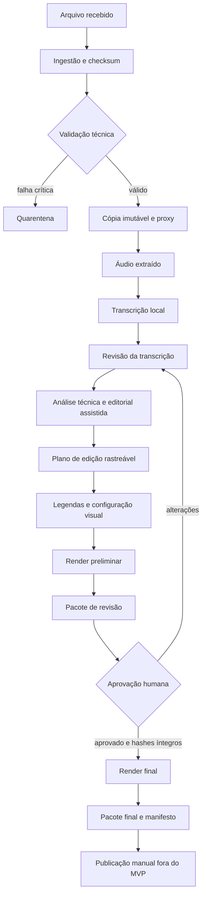

# Fluxo de dados

## Visão geral



## Entradas confiáveis e não confiáveis

São entradas não confiáveis até validação:

- nomes e conteúdo de arquivos recebidos;
- metadados embutidos;
- transcrição automática;
- textos sugeridos por IA;
- nomes, cargos, datas e instituições;
- logos, fontes, trilhas e outros assets sem registro;
- respostas de providers externos.

São fontes de verdade somente após o gate correspondente:

- checksum do original calculado na ingestão;
- transcript corrigido e marcado como revisado;
- dados factuais confirmados por pessoa responsável;
- assets aprovados no registro;
- edit plan aprovado;
- `approval.json` válido para os hashes atuais.

## Etapas e artefatos

| Etapa | Entrada | Saída principal | Validação |
|---|---|---|---|
| Receive | arquivo bruto | registro de recebimento | extensão, tamanho, caminho seguro |
| Ingest | bruto | original copiado + SHA-256 | cópia e hash idêntico |
| Probe | original | `technical-report.json` | schema, streams, duração |
| Proxy | original | `proxy.mp4` | probe, resolução, duração tolerada |
| Audio | original/proxy | `extracted.wav` | PCM esperado, duração |
| Transcribe | áudio | `transcript.json`, TXT, SRT | schema, monotonicidade, bounds |
| Transcript review | transcript | correções + versão revisada | revisor e diff |
| Analyze | mídia + transcript | silêncio, candidatos, riscos | timecodes dentro da origem |
| Plan | análise | `edit-plan.json` | segmentos, sobreposição, duração |
| Caption | transcript/plano | SRT/VTT/ASS | quebras, tempo, duas linhas |
| Draft render | plano + template | `preview.mp4` | probe, áudio, frames e manifest |
| Review | preview + artefatos | checklist e notas | identidade do revisor |
| Approve | revisão | `approval.json` | hashes e autorizações |
| Final render | artefatos aprovados | masters e derivados | gate, probe e QC |
| Package | final | manifesto e pacote | inventário e hashes |

## Diretórios e transições

```text
01_inbox -> 02_processing -> 03_review -> 04_approved
                                             |
                                             +-> render final

qualquer etapa inválida -> 99_quarantine
publicação manual confirmada -> 05_published
```

Mover um diretório não é suficiente para mudar o estado. A transição só ocorre pelo caso de uso, após validar artefatos e registrar evento. `05_published` representa uma confirmação humana; o MVP não publica.

## Máquina de estados

Transições permitidas:

```text
received -> validated | quarantined
validated -> transcribed | quarantined
transcribed -> analyzed | changes_requested
analyzed -> edit_planned | changes_requested
edit_planned -> draft_rendered | changes_requested
draft_rendered -> under_review
under_review -> changes_requested | approved
changes_requested -> transcribed | analyzed | edit_planned | draft_rendered
approved -> final_rendered
final_rendered -> published | archived
published -> archived
```

Regras:

- `quarantined` exige justificativa para retornar a `received`;
- `approved` é invalidado se qualquer hash vinculado mudar;
- `published` nunca é alcançado automaticamente no MVP;
- toda transição registra ator, horário, estado anterior, novo estado e motivo;
- estados não podem ser saltados por edição manual de YAML.

## Contrato entre Python e HyperFrames

O adapter grava um `render-request.json` com:

- `schema_version`;
- caminhos relativos sob o projeto;
- dimensões, FPS e duração;
- segmentos e timecodes;
- captions;
- textos já aprovados;
- IDs e versões dos assets;
- áreas seguras;
- destino temporário.

O processo Node devolve `render-result.json` e exit code:

- `0`: sucesso validado;
- `2`: entrada inválida;
- `3`: dependência ausente;
- `4`: falha de lint/layout/contraste;
- `5`: falha de render;
- `6`: saída inválida.

`stdout` será reservado a JSON estruturado e `stderr` a logs humanos. Nenhuma composição decide cortes editoriais.

## Controle de tempo

- A sequência visual deve somar a duração-alvo. Quando houver fala contínua sobre B-roll, `audio_segments` registra separadamente a origem, o excerto literal e os limites na timeline; sua duração deve ser preservada.
- Origem preserva timebase e frame rate reportados pelo FFprobe.
- Artefatos canônicos usam segundos decimais com precisão definida pelo schema.
- O edit plan nunca usa texto como única referência: sempre inclui arquivo, `in`, `out` e trecho.
- Conversões para frame usam racional, não `float` acumulado.
- Segmentos não podem ultrapassar a duração da origem.
- Cortes adjacentes e remoções precisam de contexto revisável antes/depois.

## Prevenção de alteração de sentido

O relatório de revisão apresenta, para cada segmento:

- fala usada;
- fala imediatamente anterior e posterior;
- timecodes;
- lacunas removidas;
- alertas de negação, condição, causalidade e mudança de sujeito;
- ordem original e ordem proposta.

O sistema sugere; uma pessoa confirma. Reescritas nunca são inseridas como fala. Texto editorial ou correção de legenda é identificado separadamente da transcrição literal.

## Retomada e idempotência

A chave de cada etapa combina:

- checksums das entradas;
- versão da configuração;
- versão do schema;
- versão do provider;
- parâmetros relevantes;
- versão das ferramentas.

Se a chave e as validações coincidem, a etapa pode reutilizar o artefato. Saídas parciais ficam em diretório temporário e não avançam o estado.
